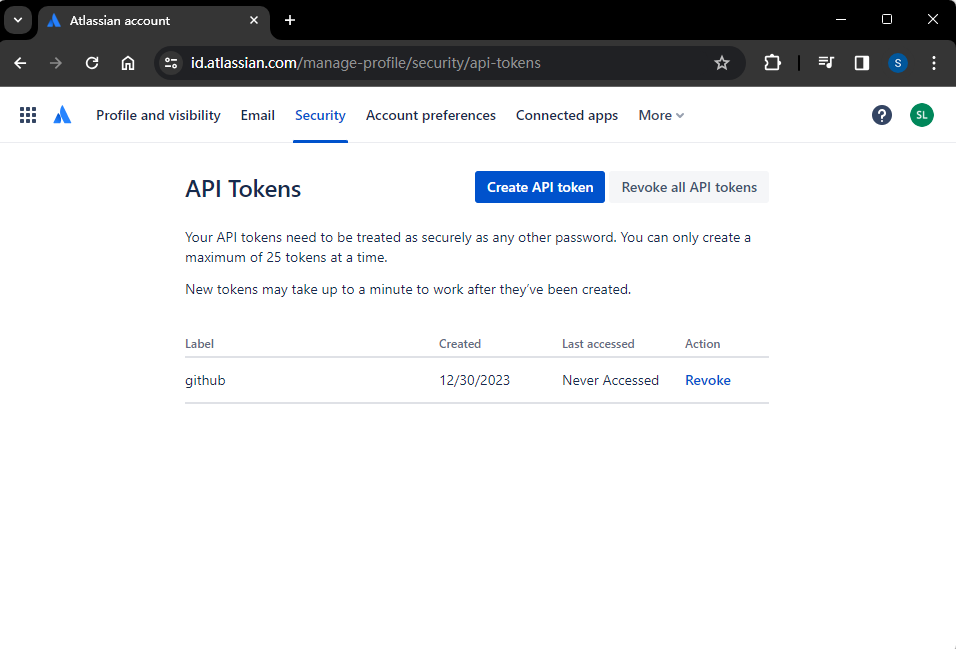

# Github + Jira Integration with flask

## Create Virtual Enviroment and install dependencies

- run `python -m venv venv`
- use `venv\Scripts\Activate.ps` for Windows or `source venv/bin/activate` for mac/linux
- use `pip install -r requirements.txt` to install all dependencies

## Configure Jira API

- generate api in account management -> security ->API, and added the generated API Key to ENV file
  
- use email associated with Jira Account and the Domain for Jira Software in ENV file

## Host Flask App on EC2

- Create EC2 instance with Amazon Linux AMI
- use vim or scp to copy the code to the EC2 instance
- execute `python github-jira.py`

## Add Webhook to desire github repo

- add the public DNS of the EC2 instance with port as 5000 and /createJIRA
